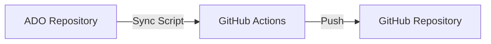

# Azure DevOps Sync with GitHub

This repository provides a solution to periodically synchronize a private Azure DevOps repository with a secondary public GitHub repository. It includes a bash script and GitHub Actions workflow that automate the synchronization process.

## Overview

The synchronization process involves the following steps:

1. **Azure DevOps Repository**: Your private repository hosted on Azure DevOps.

2. **Sync Script**: A bash script (`ado-github-sync.sh`) is used to clone the Azure DevOps repository, fetch the latest changes, and push them to the GitHub repository.

3. **GitHub Repository**: The secondary public repository hosted on GitHub, acting as a mirror of the Azure DevOps repository.

4. **GitHub Actions**: A GitHub Actions workflow (`gha-sync.yml`) is triggered periodically or on demand to execute the sync script and keep the GitHub repository up to date.

## Getting Started

To use this synchronization method, follow these steps:

1. Clone this repository to your local machine.

2. Configure the necessary variables in the `ado-github-sync.sh` script, such as the Azure DevOps repository URL and the GitHub repository URL.

3. Test the synchronization process locally by executing the `ado-github-sync.sh` script and verifying that the changes are reflected in the GitHub repository.

4. Create a new GitHub repository to act as the mirror of your Azure DevOps repository, if you haven't already.

5. In the GitHub repository, go to the **Settings** tab, then select **Secrets**. Add the required secrets (e.g., Azure DevOps credentials) that will be used during the synchronization process.

6. In the `.github/workflows/gha-sync.yml` file, adjust the synchronization frequency or triggers according to your needs.

7. Commit and push the changes to your GitHub repository.

8. GitHub Actions will automatically execute the synchronization process based on the configured triggers, ensuring your GitHub repository stays synchronized with your Azure DevOps repository.

## Contributions

Contributions are welcome! If you encounter any issues or have suggestions for improvements, please submit an issue or pull request in this repository.

## License

This project is licensed under the [MIT License](LICENSE).

---
